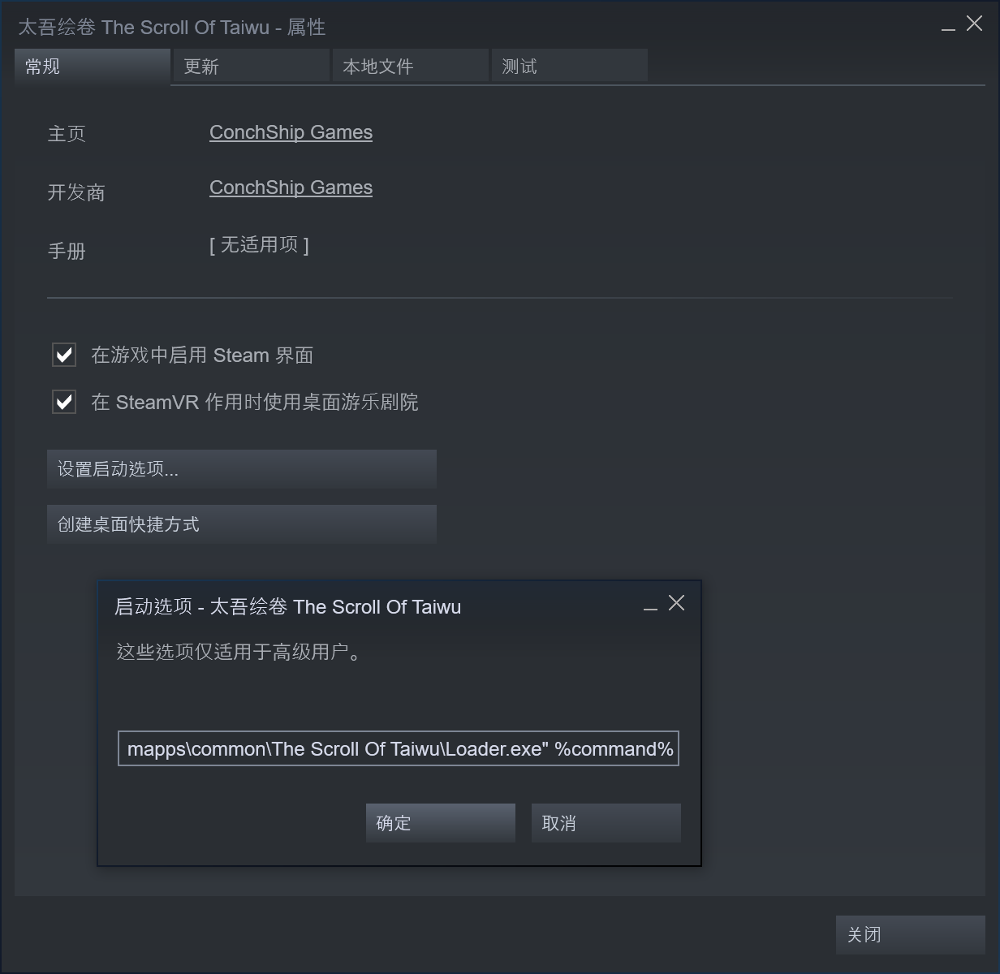

# Taiwu-Mod-Loader

不会替换游戏文件的太吾绘卷 Mod 加载器

## 使用方法

参考下图将 `Loader.exe` 设置为游戏启动的入口。

格式为 `"<游戏目录的绝对路径>\Loader.exe" %command%`，注意路径中有空格时请加上双引号。

例如：`"D:\Windows\SteamLibrary\steamapps\common\The Scroll Of Taiwu\Loader.exe" %command%`

## 编译方法

编译前请先在 `Loader` 的项目属性中设置游戏目录中 `Managed` 目录的引用路径以解析 Unity 的引用，例如 `D:\Windows\SteamLibrary\steamapps\common\The Scroll Of Taiwu\The Scroll Of Taiwu Alpha V1.0_Data\Managed\`。